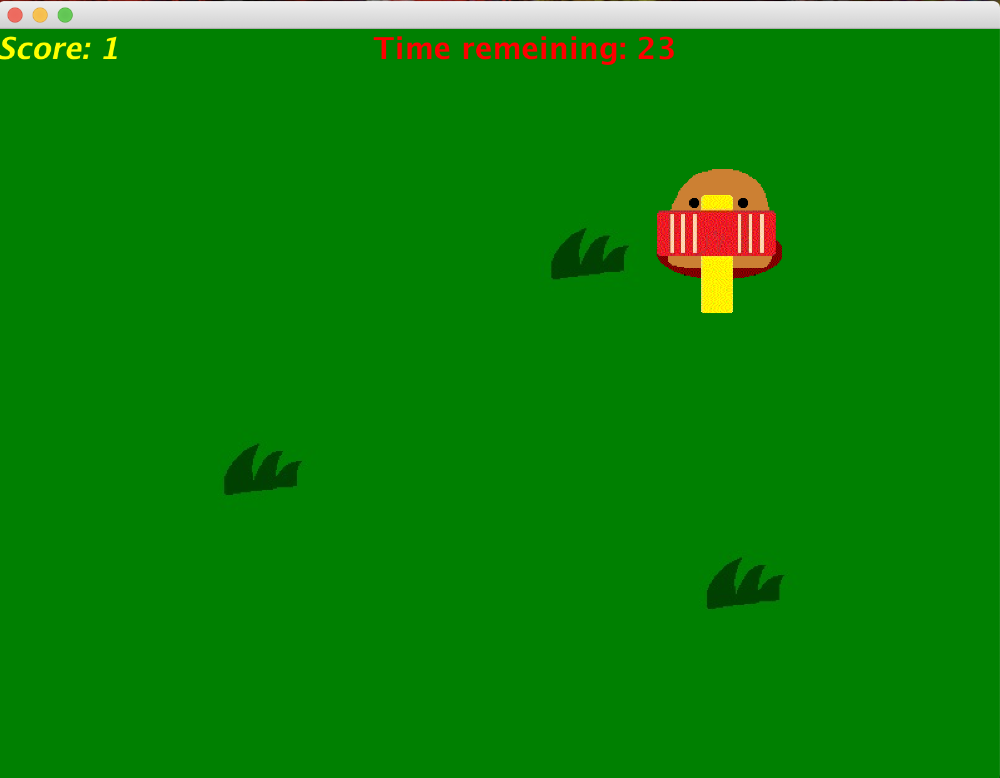
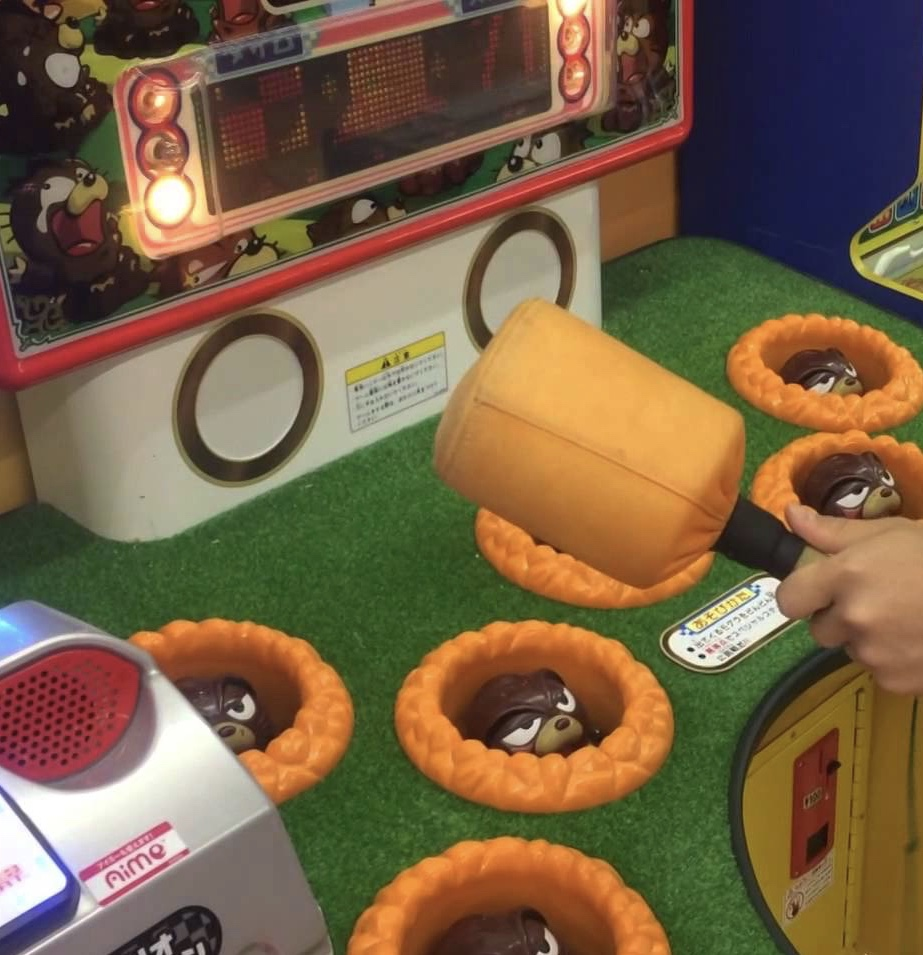

# java game
This is a personal project to build a simple game using java.

# 1. Mole Slap: Japanese Retro Arcade Game
In this game, player tries to slap as many moles as they can within 30 seconds.
The moles appear randomly in the map and they look painful once hit.

This is based on famous Japanese arcade game called Mogura-Tataki, meaning mole slap.

# 2. Asteroid
The game is a zen style dodging game. 
Player aims to fly as long as they can while dodging randomly spinning asteroids.
The first rule of Newton is implemented to the game physics.
The rule says: in an inertial frame of reference, an object either remains at rest or continues to move at a constant velocity, unless acted upon by a force.
The ship won't stop until you apply thrust to the other way or hit the end of screen.
Picture of Hyperion, a satellite of Satan is used as image of flying asteroids even though it's not technically an asteroid.

